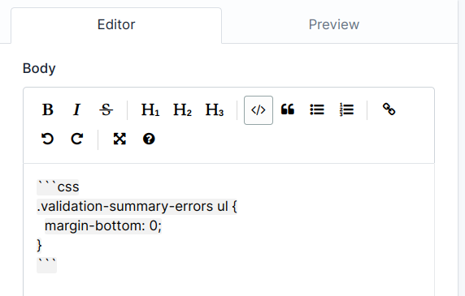
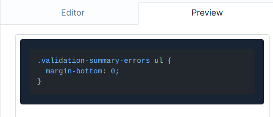

| Branch  | Status                                                                                                          |
| ------- | --------------------------------------------------------------------------------------------------------------- |
| main    |     |
| develop |  |

---

-   `.env` file must be created on the `ExamSystem.HttpApi` project in the same level of `Program.cs` file
-   `.env.example` is given as an example in the `docs` folder. copy the code inside this file into `.env` and initialize them with proper credentials.
-   to receive cookie properly in angular from backend, you have to use same scheme. That means http to http or https to https will be allowed.If you run server from https and angular from http, no cookie will be sent.
-   The values of environment variables must be enclosed in double quote and no space between `=` and `"value"` For example: `USER="John Doe"`
-   Do not initialize the empty value in `appsettings.json`, otherwise they will be committed to git. These empty values will be replaced from your `.env` file
-   Do not add `/` before the `DATAPROTECTIONDIRECTORYPATH` ; keep it the same as given in  `.env.example`, or it will store the data protection keys outside the project.
-   In the docs Folder there is a plyr.md to see the guide how to use video plyr.
-   In the docs Folder there is a lightbox.md to see the guide how to show imgages on our question there is two example in fileController photoView action.
-   In the docs Folder there is a dropzone.md to see the guide how to post imgages on our question.
-   Try to use partials for loading external dependencies that are used in multiple views.
-   [tom-select](https://tom-select.js.org/) is added for multi-option selection. Duplicate tag creation is disabled. Read the docs properly for customization on demand.
-   [tabulator](https://tabulator.info/) is added for showing data in tabular format. Read the docs properly for customization on demand. It heavily depends on Dynamic Linq. To use sorting on multiple columns, `ctrl` key must be pressed and will be turned off when released. In case of a tie (duplicate value in the first column), the subsequent columns will make effect.
-   `Bogus` nuget pkg can be used for generating bulk fake data.
-   `.editorconfig` file is added. Run the following command from the same level where `ExamSystem.sln` is present. Doing so will format all the `cs` files.

```bash
dotnet format --verbosity diagnostic
```

-   For writting code snippet using the markdown editor, use markdown syntax where codes are enclosed in three backticks. Backticks can be added automatically by selecting the codes and clicking on the code button on the editor panel (7th icon from the start).
-   However, The first backtick must mention the used language. For example, in the following image, `css` is added after the opening backticks. For all the language codes, [Check Aliases section here](https://github.com/highlightjs/highlight.js/blob/main/SUPPORTED_LANGUAGES.md)


<br>
<br>
The rendered result will be like:
<br>
<br>

